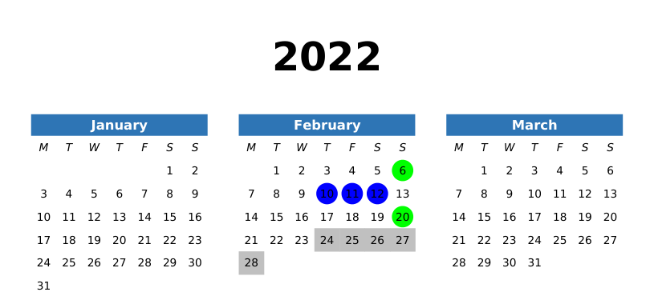

# calendar

A simple program to generate calendars with certain days shaded in.

## How to use

1. Clone the repository and put the following in a file called `log.toml`:

```toml
[highlights]
green = { shape = "circle", colour = "#00FF00" }
blue = { shape = "circle", colour = "#0000FF" }
grey = { shape = "rectangle", colour = "#C0C0C0" }

[data]
2022-02-01.Tue = ""
2022-02-02.Wed = ""
2022-02-03.Thu = ""
2022-02-04.Fri = ""
2022-02-05.Sat = ""
2022-02-06.Sun = "green"
2022-02-07.Mon = ""
2022-02-08.Tue = ""
2022-02-09.Wed = ""
2022-02-10.Thu = "blue"
2022-02-11.Fri = "blue"
2022-02-12.Sat = "blue"
2022-02-13.Sun = ""
2022-02-14.Mon = ""
2022-02-15.Tue = ""
2022-02-16.Wed = ""
2022-02-17.Thu = ""
2022-02-18.Fri = ""
2022-02-19.Sat = ""
2022-02-20.Sun = "green"
2022-02-21.Mon = ""
2022-02-22.Tue = ""
2022-02-23.Wed = ""
2022-02-24.Thu = "grey"
2022-02-25.Fri = "grey"
2022-02-26.Sat = "grey"
2022-02-27.Sun = "grey"
2022-02-28.Mon = "grey"
```

2. Run `cargo run`

3. The resulting `calendar.pdf` should contain this:



Tip: To help you generate the rows of the TOML file, we also provide a `generate-days-from` command:

```
$ cargo run generate-days-from 2023-01-29 2023-02-04
    Finished dev [unoptimized + debuginfo] target(s) in 0.03s
     Running `target/debug/calendar generate-days-from 2023-01-29 2023-02-04`
2023-01-29.Sun = ""
2023-01-30.Mon = ""
2023-01-31.Tue = ""
2023-02-01.Wed = ""
2023-02-02.Thu = ""
2023-02-03.Fri = ""
2023-02-04.Sat = ""
```
